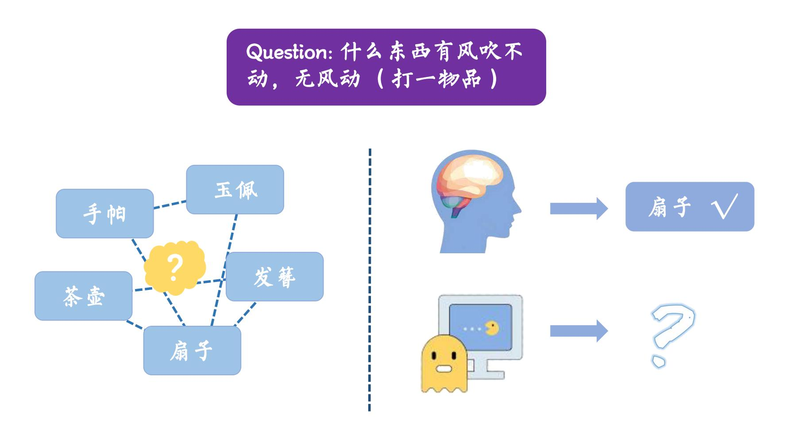

# chinese-riddle-solver

We built a hybrid model combining embedding model for glyph and pre-trained model ERNIE.
For riddles with single character, we use the glyph based model directly. For riddles longer than one character, we use ERNIE to select the right answer among the given 5 choices.

- font.ipynb: the embedding model for glyph
- riddle-2class.ipynb: convert 5 category classification to binary classification.
- riddle-similarity: compare the similarity between the question(riddle) and 5 answers respectively, select the most similar one as the result.
- prompt-guess: reform the question"什么东西有风吹不动，无风动（打一物品）"(the answer is "扇子") to "什么东西有风吹不动，无风动。这个物品是扇子". Then mask the answer "扇子"(the input is "什么东西有风吹不动，无风动。这个物品是[MASK][MASK]"), train the model to fill the [MASK] blank. For evaluation, compare the given output with the choices and select the most similar one.
- multi-choice-erinie.ipynb: bert for multiple choice
- qagnn: the preprocessing code for Chinese of the paper "QA-GNN: Reasoning with Language Models and Knowledge Graphs for Question Answering"
- riddlesense
